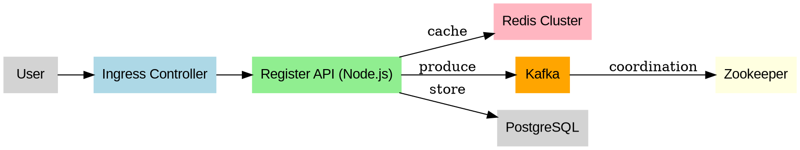

# ⚡ Coinza Scalling – Distributed Microservice Architecture

This repository contains the foundation for the scalable backend of **Coinza Exchange**.  
It showcases a microservice architecture built with **Kubernetes**, **Kafka**, **Redis**, and **PostgreSQL**.

> ⚠️ **NOTE:** The original matching engine processor was corrupted. This repository only demonstrates the **microservices structure and flow**.  
> Some files may be broken or partially implemented. These issues do **not prevent the system from working**, and will be fixed gradually when time allows.

---

## 📦 Tech Stack

- **Node.js** – Application logic (e.g. register-user service)
- **Apache Kafka (Strimzi)** – Messaging layer
- **Redis Cluster** – High-speed caching
- **PostgreSQL** – Persistent database
- **Zookeeper** – Kafka coordination
- **Docker** – Container builds
- **Kubernetes** – Orchestration (Helm, StatefulSet, ConfigMap, HPA, Ingress)

---

## 🚀 Getting Started

### Install Helm and set context to Minikube

```bash
sudo snap install helm --classic
kubectl config use-context minikube
```

### Deploy Core Infrastructure

```bash
kubectl apply -f k8s/redis/redis-configmap.yaml
kubectl apply -f k8s/redis/redis-pv.yaml
kubectl apply -f k8s/redis/redis-service.yaml
kubectl apply -f k8s/redis/redis-statefulset.yaml

kubectl apply -f k8s/postgres/postgres.yaml
kubectl apply -f k8s/kafka/kafka.yaml
kubectl apply -f k8s/zookeeper/zookeeper-deployment.yaml
kubectl apply -f k8s/zookeeper/zookeeper-service.yaml
kubectl apply -f k8s/kafka/kafka-statefulset.yaml
kubectl apply -f k8s/kafka/kafka-service.yaml
kubectl apply -f k8s/popular/base/init-variables-on-redis.yaml

kubectl apply -f k8s/matching-engine/deployment.yaml
kubectl apply -f k8s/matching-engine/hpa-matching-engine.yaml
kubectl apply -f k8s/matching-engine/matching-engine-service.yaml
kubectl apply -f k8s/matching-engine/matching-engine-ingress.yaml
```

---

## 🧠 Redis Cluster Initialization

```bash
echo "yes" | redis-cli --cluster create \
  redis-cluster-0.redis-cluster.redis-cluster.svc.cluster.local:6379 \
  redis-cluster-1.redis-cluster.redis-cluster.svc.cluster.local:6379 \
  redis-cluster-2.redis-cluster.redis-cluster.svc.cluster.local:6379 \
  redis-cluster-3.redis-cluster.redis-cluster.svc.cluster.local:6379 \
  redis-cluster-4.redis-cluster.redis-cluster.svc.cluster.local:6379 \
  redis-cluster-5.redis-cluster.redis-cluster.svc.cluster.local:6379 \
  --cluster-replicas 1
```

---

## 🐳 Docker Builds

```bash
docker build -t samirsauma/matching-engine:v78 .
docker push samirsauma/matching-engine:v78

docker build -t samirsauma/init-variables-on-redis:v6 .
docker push samirsauma/init-variables-on-redis:v6
```

---

## 📡 Kafka Topics

```bash
kubectl exec -it kafka-0 -n kafka -- \
  /opt/kafka/bin/kafka-topics.sh --create \
  --topic register-api-1 \
  --bootstrap-server localhost:9092 \
  --replication-factor 1 \
  --partitions 1
```

---

## 🔁 Restart Services

```bash
kubectl rollout restart deployment matching-engine -n matching-engine
```

---

## 🔍 Logs

```bash
kubectl logs -l app=matching-engine -n matching-engine --tail=100 --follow
kubectl logs -f matching-engine-[pod-id] -n matching-engine
```

---

## 🧼 Kafka Cleanup

```bash
kubectl delete statefulset kafka -n kafka --cascade=foreground
kubectl delete statefulset zookeeper -n kafka --cascade=foreground
kubectl delete svc kafka -n kafka
kubectl delete svc zookeeper -n kafka
kubectl delete pvc -n kafka --all
kubectl delete namespace kafka
```

---

## 🧠 Architecture (DOT Graph)



---

### 🧊 Status

- Matching logic is currently **not available** (corrupted processor)
- System structure is functional
- Some files may be incomplete/corrupted — to be fixed gradually

---

### ✌️ Built by Samir Sauma — Coinza Exchange (WaaS Infra)
