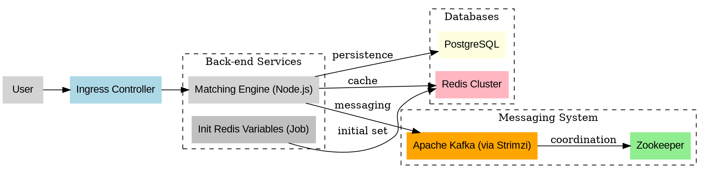

# ⚡ Coinza Scalling (Distributed Matching Engine)

This project represents the processing core of **Coinza Exchange** — a **scalable and distributed matching engine** built with **Kubernetes**, using **Redis Cluster**, **PostgreSQL**, and **Apache Kafka** (⛔️ *no RabbitMQ here!*).

---

## 📦 Stack Overview

- **Node.js** – Main engine logic
- **Redis Cluster** – High-performance in-memory caching and real-time operations
- **PostgreSQL** – Reliable transactional data storage
- **Apache Kafka (via Strimzi)** – Messaging backbone for decoupled communication
- **Zookeeper** – Kafka coordination
- **Kubernetes (Helm, ConfigMap, StatefulSet, HPA, Ingress)** – Container orchestration and scaling
- **Docker** – Image packaging

---

## 🚀 Getting Started on Minikube

### 1. Prerequisites

```bash
sudo snap install helm --classic
kubectl config use-context minikube
```

---

## 🔧 Deploy the Infrastructure

### Redis Cluster

```bash
kubectl apply -f k8s/redis/redis-configmap.yaml
kubectl apply -f k8s/redis/redis-pv.yaml
kubectl apply -f k8s/redis/redis-service.yaml
kubectl apply -f k8s/redis/redis-statefulset.yaml
```

### PostgreSQL

```bash
kubectl apply -f k8s/postgres/postgres.yaml
```

### Matching Engine (Core)

```bash
kubectl apply -f k8s/matching-engine/deployment.yaml
kubectl apply -f k8s/matching-engine/hpa-matching-engine.yaml
kubectl apply -f k8s/matching-engine/matching-engine-service.yaml
kubectl apply -f k8s/matching-engine/matching-engine-ingress.yaml
```

### Initialize Redis Variables

```bash
kubectl apply -f k8s/popular/base/init-variables-on-redis.yaml
```

---

## 🛰 Kafka & Zookeeper with Strimzi

```bash
kubectl create namespace kafka
kubectl apply -f https://strimzi.io/install/latest?namespace=kafka

kubectl apply -f k8s/zookeeper/zookeeper-deployment.yaml
kubectl apply -f k8s/zookeeper/zookeeper-service.yaml
kubectl apply -f k8s/kafka/kafka.yaml
kubectl apply -f k8s/kafka/kafka-statefulset.yaml
kubectl apply -f k8s/kafka/kafka-service.yaml
```

---

## 🧠 Redis Cluster Creation

```bash
echo "yes" | redis-cli --cluster create \
  redis-cluster-0.redis-cluster.redis-cluster.svc.cluster.local:6379 \
  redis-cluster-1.redis-cluster.redis-cluster.svc.cluster.local:6379 \
  redis-cluster-2.redis-cluster.redis-cluster.svc.cluster.local:6379 \
  redis-cluster-3.redis-cluster.redis-cluster.svc.cluster.local:6379 \
  redis-cluster-4.redis-cluster.redis-cluster.svc.cluster.local:6379 \
  redis-cluster-5.redis-cluster.redis-cluster.svc.cluster.local:6379 \
  --cluster-replicas 1
```

---

## 🐳 Docker Builds

```bash
docker build -t samirsauma/matching-engine:v78 .
docker push samirsauma/matching-engine:v78

docker build -t samirsauma/init-variables-on-redis:v4 .
docker push samirsauma/init-variables-on-redis:v4
```

---

## 🔁 Restart Matching Engine

```bash
kubectl rollout restart deployment matching-engine -n matching-engine
```

---

## 🔍 Logs & Debug

```bash
kubectl logs -l app=matching-engine -n matching-engine --tail=100 --follow
kubectl logs -f matching-engine-[pod-id] -n matching-engine
kubectl logs --previous matching-engine-[pod-id] -n matching-engine
```

---

## 📡 Kafka Topics

### Create a Topic

```bash
/opt/kafka/bin/kafka-topics.sh \
  --bootstrap-server kafka-kafka-bootstrap:9092 \
  --create \
  --topic order_topic \
  --partitions 3 \
  --replication-factor 1
```

### List Topics

```bash
/opt/kafka/bin/kafka-topics.sh \
  --bootstrap-server kafka-kafka-bootstrap:9092 \
  --list
```

---

## 🧼 Clean Kafka/Zookeeper

```bash
kubectl delete statefulset kafka -n kafka --cascade=foreground
kubectl delete statefulset zookeeper -n kafka --cascade=foreground
kubectl delete svc kafka -n kafka
kubectl delete svc zookeeper -n kafka
kubectl delete pvc -n kafka --all
kubectl delete namespace kafka
```

---

## 🧠 Architecture Diagram (.dot)



---

### ✌️ By Samir – Coinza WaaS | Matching Engine | Scalling Real
