# ⚡ Coinza Scalling (Matching Engine Distribuído)

Esse projeto representa o core de processamento da Coinza Exchange, um **matching engine escalável**, distribuído via Kubernetes, usando **Redis Cluster**, **PostgreSQL** e **Apache Kafka** (⛔️ *nada de RabbitMQ aqui!*).

---

## 📦 Tecnologias Utilizadas

- Node.js
- Redis (Cluster)
- PostgreSQL
- Apache Kafka (via Strimzi)
- Zookeeper
- Kubernetes (Helm, ConfigMap, StatefulSet, HPA, Ingress)
- Docker

---

## 🚀 Como Subir no Minikube

### 1. Pré-requisitos
```bash
sudo snap install helm --classic
kubectl config use-context minikube
```

---

## 🔧 Deploy da Infraestrutura

### Redis Cluster
```bash
kubectl apply -f k8s/redis/redis-configmap.yaml
kubectl apply -f k8s/redis/redis-pv.yaml
kubectl apply -f k8s/redis/redis-service.yaml
kubectl apply -f k8s/redis/redis-statefulset.yaml
```

### PostgreSQL
```bash
kubectl apply -f k8s/postgres/postgres.yaml
```

### Matching Engine (Core)
```bash
kubectl apply -f k8s/matching-engine/deployment.yaml
kubectl apply -f k8s/matching-engine/hpa-matching-engine.yaml
kubectl apply -f k8s/matching-engine/matching-engine-service.yaml
kubectl apply -f k8s/matching-engine/matching-engine-ingress.yaml
```

### Init de Variáveis no Redis
```bash
kubectl apply -f k8s/popular/base/init-variables-on-redis.yaml
```

---

### Apache Kafka + Zookeeper (Strimzi)
```bash
kubectl create namespace kafka
kubectl apply -f https://strimzi.io/install/latest?namespace=kafka

kubectl apply -f k8s/zookeeper/zookeeper-deployment.yaml
kubectl apply -f k8s/zookeeper/zookeeper-service.yaml
kubectl apply -f k8s/kafka/kafka.yaml
kubectl apply -f k8s/kafka/kafka-statefulset.yaml
kubectl apply -f k8s/kafka/kafka-service.yaml
```

---

## 🧠 Cluster Redis - Criação
```bash
echo "yes" | redis-cli --cluster create \
  redis-cluster-0.redis-cluster.redis-cluster.svc.cluster.local:6379 \
  redis-cluster-1.redis-cluster.redis-cluster.svc.cluster.local:6379 \
  redis-cluster-2.redis-cluster.redis-cluster.svc.cluster.local:6379 \
  redis-cluster-3.redis-cluster.redis-cluster.svc.cluster.local:6379 \
  redis-cluster-4.redis-cluster.redis-cluster.svc.cluster.local:6379 \
  redis-cluster-5.redis-cluster.redis-cluster.svc.cluster.local:6379 \
  --cluster-replicas 1
```

---

## 🐳 Docker - Build e Deploy
```bash
docker build -t samirsauma/matching-engine:v78 .
docker push samirsauma/matching-engine:v78

docker build -t samirsauma/init-variables-on-redis:v4 .
docker push samirsauma/init-variables-on-redis:v4
```

---

## 🔁 Restart do Matching Engine
```bash
kubectl rollout restart deployment matching-engine -n matching-engine
```

---

## 🔎 Logs
```bash
kubectl logs -l app=matching-engine -n matching-engine --tail=100 --follow
kubectl logs -f matching-engine-[pod-id] -n matching-engine
kubectl logs --previous matching-engine-[pod-id] -n matching-engine
```

---

## 📡 Kafka - Criar e Listar Tópicos
```bash
/opt/kafka/bin/kafka-topics.sh \
  --bootstrap-server kafka-kafka-bootstrap:9092 \
  --create \
  --topic order_topic \
  --partitions 3 \
  --replication-factor 1

/opt/kafka/bin/kafka-topics.sh \
  --bootstrap-server kafka-kafka-bootstrap:9092 \
  --list
```

---

## 🧼 Limpar Kafka e Zookeeper
```bash
kubectl delete statefulset kafka -n kafka --cascade=foreground
kubectl delete statefulset zookeeper -n kafka --cascade=foreground
kubectl delete svc kafka -n kafka
kubectl delete svc zookeeper -n kafka
kubectl delete pvc -n kafka --all
kubectl delete namespace kafka
```

---

## 🧠 Arquitetura (.dot)

```dot
digraph CoinzaScalling {
  rankdir=LR;
  node [shape=box, style=filled, color=lightgray, fontname="Arial"];

  User [label="Usuário"];
  Ingress [label="Ingress Controller", color=lightblue];
  MatchingEngine [label="Matching Engine (Node.js)"];
  RedisCluster [label="Redis Cluster", color=lightpink];
  Postgres [label="PostgreSQL", color=lightyellow];
  Kafka [label="Apache Kafka (via Strimzi)", color=orange];
  Zookeeper [label="Zookeeper", color=lightgreen];
  InitRedis [label="Init Redis Variables (Job)", color=gray];

  User -> Ingress;
  Ingress -> MatchingEngine;

  MatchingEngine -> RedisCluster [label="cache"];
  MatchingEngine -> Postgres [label="persistência"];
  MatchingEngine -> Kafka [label="mensageria"];

  Kafka -> Zookeeper [label="coordenação"];
  InitRedis -> RedisCluster [label="set inicial"];

  subgraph cluster_backend {
    label = "Back-end Services";
    style=dashed;
    MatchingEngine;
    InitRedis;
  }

  subgraph cluster_kafka {
    label = "Mensageria";
    style=dashed;
    Kafka;
    Zookeeper;
  }

  subgraph cluster_db {
    label = "Databases";
    style=dashed;
    RedisCluster;
    Postgres;
  }
}
```



---

### ✌️ By Samir – Coinza WaaS | Matching Engine | Scalling Real
